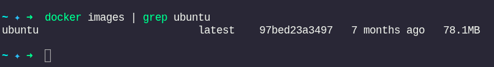
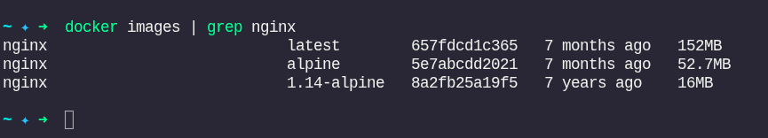
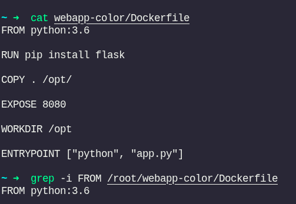
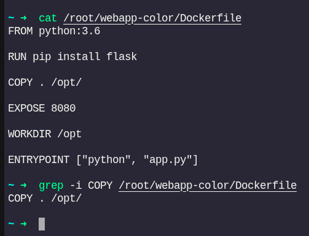
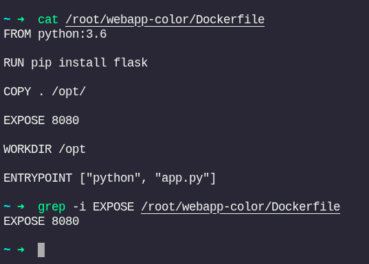
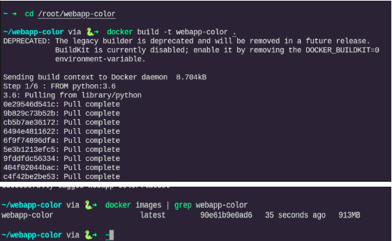
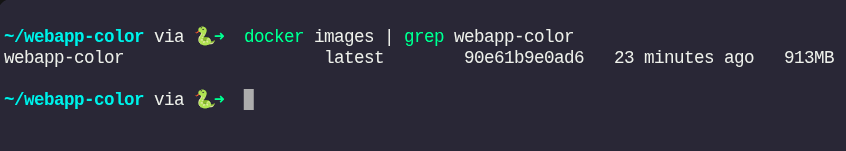

# Docker Class Practical Report – KodeKloud

## 1. Aim

The aim of this practical was to apply Docker skills on the KodeKloud platform by managing images, examining Dockerfiles, building custom images, running containers with published ports, and improving image efficiency using a lightweight base image.

---

## 2. Introduction / Background Information

Docker packages applications and their dependencies into isolated environments called **containers**. Unlike virtual machines, containers are fast, portable, and efficient.

### Key terms used in this practical:
- **Image** – A static template used to create containers (for example, `ubuntu` or `nginx`)
- **Container** – A running instance of an image
- **Dockerfile** – A script that defines how to build an image
- **Tag** – A label attached to an image (for example, `latest` or `lite`)
- **Port Publishing** – Mapping a container port to a host port so the service can be accessed externally

---

## 3. Procedures and Results

### Task 1 – Checking Available Images on the Host

Command:
```bash
docker images
```

I used this command to list all Docker images present on the host and confirm that the environment was ready.

Result: Docker was installed and several images were available on the system.


---

### Task 2 – Finding the Size of the Ubuntu Image

Command:
```bash
docker images | grep ubuntu
```

I filtered the image list to identify the Ubuntu image and check its size.

Result: The `ubuntu:latest` image size was 78.1MB.



---

### Task 3 – Identifying the Tag of the Newly Pulled NGINX Image

Command:
```bash
docker images | grep nginx
```

I examined the available NGINX images to verify the tag and image details.

Result: The newly pulled NGINX image was tagged `latest`.



---

### Task 4 – Finding the Base Image Used in the Dockerfile

Command:
```bash
grep -i FROM /root/webapp-color/Dockerfile
```

I checked the Dockerfile to determine the base image used to build the application image.

Result: The base image was `python:3.6`.



---

### Task 5 – Locating Where Application Code is Copied Inside the Container

Command:
```bash
grep -i COPY /root/webapp-color/Dockerfile
```

I identified the destination path inside the container where the application code is copied.

Result: The code was copied to `/opt/` inside the image.



---

### Task 6 – Finding the Instruction That Starts the Application

Command:
```bash
grep -E "CMD|ENTRYPOINT" /root/webapp-color/Dockerfile
```

I located the startup instruction that runs the application when the container starts.

Result: The Dockerfile used `ENTRYPOINT ["python", "app.py"]`.


---

### Task 7 – Finding the Port the Application Runs On Inside the Container

Command:
```bash
grep -i EXPOSE /root/webapp-color/Dockerfile
```

I checked the Dockerfile for the exposed port used by the application.

Result: The application exposed port `8080`.



---

### Task 8 – Building a Docker Image Named webapp-color

Command:
```bash
cd /root/webapp-color
docker build -t webapp-color .
```

I built the application image from the Dockerfile and tagged it as `webapp-color`.

Result: The image built successfully, with a final size of 913MB.



---

### Task 9 – Running the Container and Publishing Port 8080 to Host Port 8282

Command:
```bash
docker run -d -p 8282:8080 --name webapp-container webapp-color
```

I launched the container in detached mode and published the container port to the host so I could access the app through the browser.

Result: The container started and exposed `0.0.0.0:8282->8080/tcp`.


---

### Task 10 – Accessing the Application on HOST:8282

I opened the application using the HOST:8282 tab in KodeKloud.

Result: The web page displayed `"Hello from 72f761fd0fd3!"`.

Command to stop the container:
```bash
docker stop webapp-container
```


---

### Task 11 – Finding the Base Operating System of the python:3.6 Image

Command:
```bash
docker run --rm python:3.6 cat /etc/os-release
```

I inspected the base image to confirm which operating system it was using.

Result: The base OS was Debian GNU/Linux 11 (bullseye).


---

### Task 12 – Checking the Size of the webapp-color Image

Command:
```bash
docker images | grep webapp-color
```

I verified the size of the newly built application image.

Result: The `webapp-color` image size was 913MB.



---

### Task 13 – Observing That the Image Is Too Big

I noticed the image size was much larger than ideal. This highlighted the need to use a smaller base image to improve efficiency.

---

### Task 14 – Building a Smaller Image with the Tag lite

Change made in Dockerfile:
- Replaced `FROM python:3.6` with `FROM python:3.6-slim`

Command to rebuild:
```bash
docker build -t webapp-color:lite .
```

I rebuilt the image using a slimmer base image to reduce the overall size.

Result: The new `webapp-color:lite` image size dropped to 130MB.


---

### Task 15 – Running the Lite Image and Publishing Port 8080 to Host Port 8383

Command:
```bash
docker run -d -p 8383:8080 --name webapp-lite-container webapp-color:lite
```

I ran the optimized image and mapped its internal port to host port 8383.

Result: The container started successfully and the app was accessible on HOST:8383.


---

## 4. Conclusion

During this KodeKloud practical, I completed all 15 tasks and strengthened my Docker knowledge by:

- Listing and inspecting Docker images
- Understanding Dockerfile instructions such as `FROM`, `COPY`, `EXPOSE`, and `ENTRYPOINT`
- Building and tagging custom Docker images
- Running containers with published ports to access web applications
- Optimizing image size by switching from `python:3.6` to `python:3.6-slim`

The key lesson from this exercise is that choosing a lightweight base image is essential for creating efficient Docker images and improving deployment performance.

---

