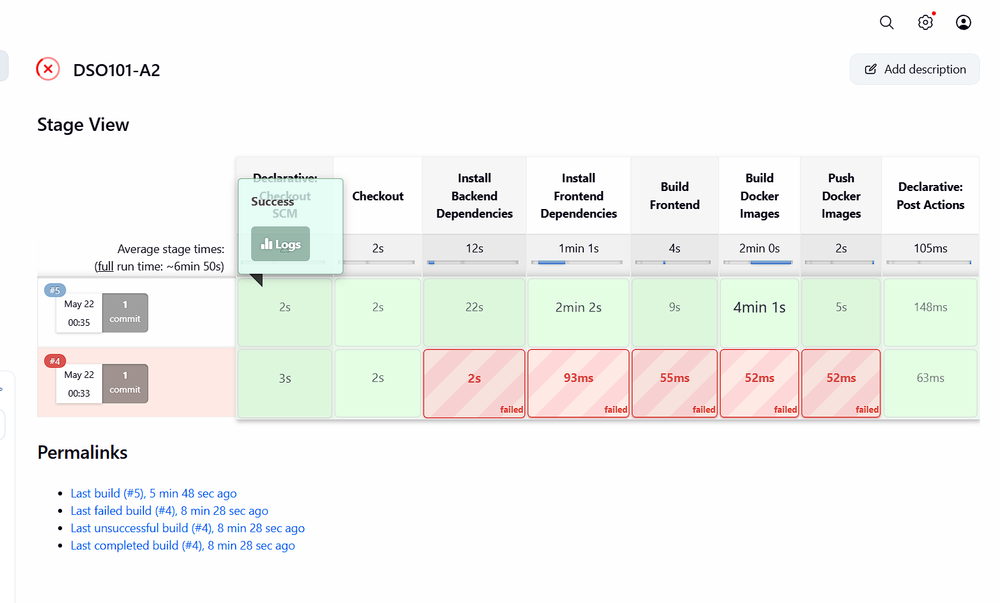
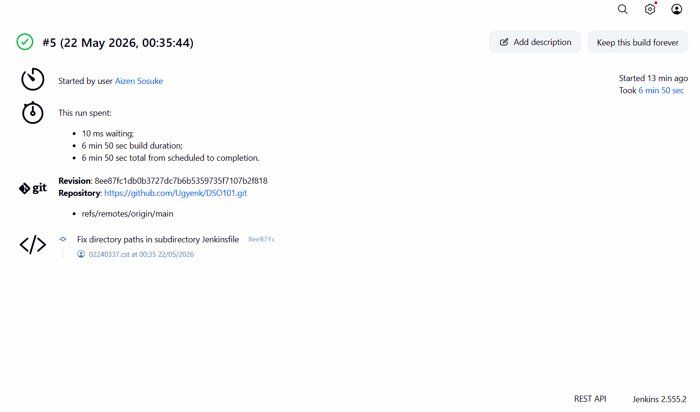

# Assignment 2 – CI/CD Pipeline with Jenkins
### DSO101 | Bachelor of Engineering in Software Engineering
### Student: Ugyen kinley Phuntshok | Student ID: 02240337

---

## Overview

This project extends the to-do list application from **Assignment 1** by integrating a fully automated CI/CD pipeline using **Jenkins**. The pipeline automates code checkout, dependency installation, building, unit testing, and Docker-based deployment — eliminating the need for manual intervention at each stage.

---

## Tools & Technologies

| Tool | Purpose |
|---|---|
| Jenkins | CI/CD automation and pipeline orchestration |
| GitHub | Source code hosting and version control |
| Node.js & npm | JavaScript runtime and package management |
| Jest + jest-junit | Unit testing and JUnit report generation |
| Docker | Containerization and deployment |

---

## Pipeline Stages

| Stage | Description |
|---|---|
| **Checkout** | Pulls the latest code from the `main` branch on GitHub |
| **Install** | Runs `npm install` to install all project dependencies |
| **Build** | Runs `npm run build` to compile/prepare the application |
| **Test** | Runs `npm test` using Jest and publishes JUnit test reports to Jenkins |
| **Deploy** | Builds a Docker image and pushes it to Docker Hub |

---

## Pipeline Configuration

### 1. Jenkins Setup

- Installed Jenkins and ran it locally on `localhost:8080`.
- Installed the following plugins via **Manage Jenkins → Plugins → Available**:
  - **NodeJS Plugin** – to run `npm` commands within the pipeline
  - **Pipeline** – to support `Jenkinsfile`-based declarative pipelines
  - **GitHub Integration** – to connect Jenkins with the GitHub repository
  - **Docker Pipeline** – to build and push Docker images
- Configured **Node.js LTS v20.x** under **Manage Jenkins → Tools → NodeJS**.

---

### 2. GitHub Repository Setup

- The Node.js to-do app from Assignment 1 was pushed to GitHub.
- A **Personal Access Token (PAT)** was generated with `repo` and `admin:repo_hook` permissions.
- The PAT was added to Jenkins under **Manage Jenkins → Credentials** as a `Username & Password` credential.

---

### 3. Jenkinsfile

A `Jenkinsfile` was created at the root of the repository defining the full pipeline:

```groovy
pipeline {
    agent any
    tools {
        nodejs 'NodeJS'
    }
    stages {
        stage('Checkout') {
            steps {
                git branch: 'main',
                    url: 'https://github.com/WangchukGyeltshen/WangchukGyeltshen_02240370_DSO101_A1.git',
                    credentialsId: 'github-creds'
            }
        }
        stage('Install') {
            steps {
                sh 'npm install'
            }
        }
        stage('Build') {
            steps {
                sh 'npm run build'
            }
        }
        stage('Test') {
            steps {
                sh 'npm test'
            }
            post {
                always {
                    junit 'junit.xml'
                }
            }
        }
        stage('Deploy') {
            steps {
                script {
                    docker.build('wangchu21/fe-todo:latest')
                    docker.withRegistry('https://registry.hub.docker.com', 'docker-hub-creds') {
                        docker.image('wangchu21/fe-todo:latest').push()
                    }
                }
            }
        }
    }
}
```

---

### 4. package.json Scripts

Jest was configured to produce JUnit-compatible reports for Jenkins:

```json
{
  "scripts": {
    "start": "node index.js",
    "build": "echo 'Build complete'",
    "test": "jest --ci --reporters=default --reporters=jest-junit"
  }
}
```

Required dev dependencies:

```bash
npm install --save-dev jest jest-junit
```

---

### 5. Pipeline Execution

1. A new **Pipeline** item was created in Jenkins.
2. Configured to use **Pipeline script from SCM** pointing to the GitHub repository.
3. Credentials were set to the GitHub PAT.
4. Script path was set to `Jenkinsfile`.
5. Pipeline was triggered via **Build Now**.

---

## Challenges Faced

### Jest & JUnit Configuration in Jenkins

**Problem:** Running `npm test` worked locally but inside Jenkins, tests either failed to run or did not produce a JUnit-compatible XML report — causing the `junit 'junit.xml'` post step to fail.

**Root Cause:** Jest does not generate JUnit XML reports by default. Jenkins requires JUnit-formatted output to display test results in the **Test Results** dashboard.

**Solution:** Installed the `jest-junit` reporter and updated the test script:

```bash
npm install --save-dev jest-junit
```

Updated `package.json`:

```json
"test": "jest --ci --reporters=default --reporters=jest-junit"
```

This generated a `junit.xml` file that Jenkins could parse and display as a structured test report.

---

## Screenshots

### Jenkins Pipeline Stage View


### Jenkins Test Results


---
