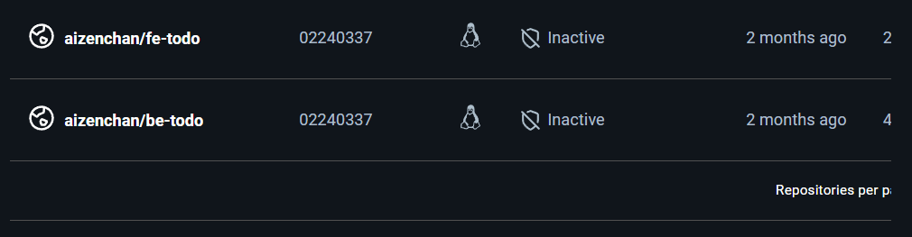
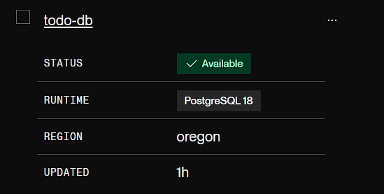
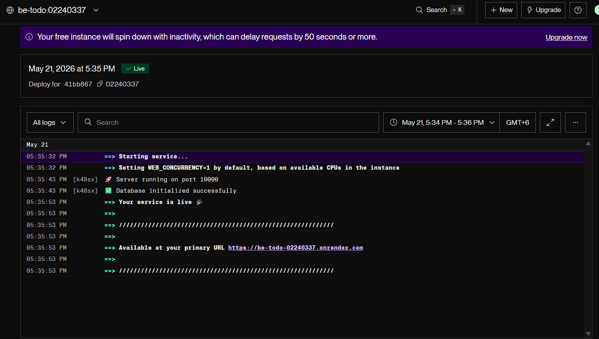
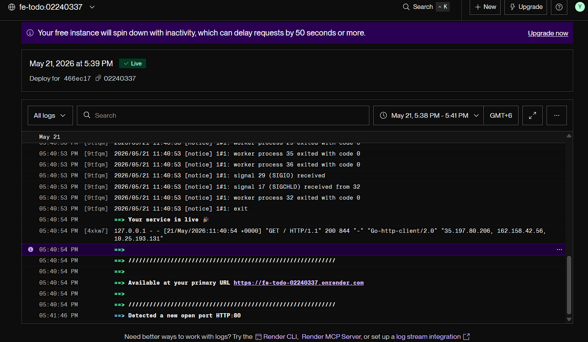
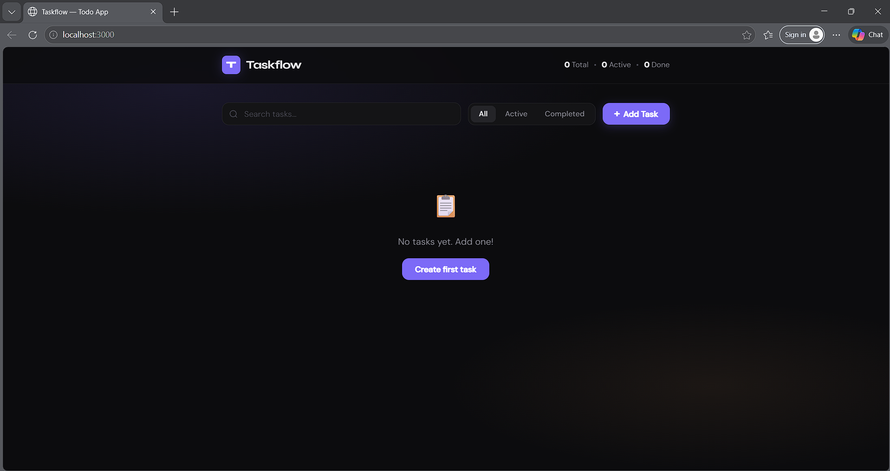

/mnt/user-data/outputs/README.md << 'EOF'
### DSO101 Assignment 1 Report
**Student Name:** `Ugyen Kinley Phuntshok`
**Student Number:** `02240337`

---

# Part A: Deploying a Pre-Built Docker Image

This section documents the steps taken to build and push Docker images to Docker Hub, and deploy them on Render.com.

---

## Step 1: Writing the Dockerfiles

**Backend Dockerfile (`backend/Dockerfile`):**
```dockerfile
FROM node:18-alpine
WORKDIR /app
COPY package*.json ./
RUN npm install
COPY . .
EXPOSE 5000
CMD ["node", "server.js"]
```

**Frontend Dockerfile (`frontend/Dockerfile`):**
```dockerfile
FROM node:18-alpine
WORKDIR /app
COPY package*.json ./
RUN npm ci
COPY . .
ARG REACT_APP_API_URL
ENV REACT_APP_API_URL=$REACT_APP_API_URL
RUN npm run build
FROM nginx:alpine
COPY --from=0 /app/build /usr/share/nginx/html
EXPOSE 80
CMD ["nginx", "-g", "daemon off;"]
```

---

## Step 2: Setting Up Environment Variables

A `.env` file was created for the backend with the following variables (not committed to Git):
- `PORT=5000` – Server port
- `DB_HOST` – PostgreSQL host
- `DB_USER` – PostgreSQL username
- `DB_PASSWORD` – PostgreSQL password
- `DB_NAME=tododb` – Database name
- `DB_PORT=5432` – Database port
- `DB_SSL=false` – SSL toggle (set to `true` on Render)
- `FRONTEND_URL=http://localhost:3000` – Allowed CORS origin

A `.env` file was created for the frontend:
- `REACT_APP_API_URL=http://localhost:5000`

The `.env` file was added to `.gitignore` to ensure it was never committed to the repository.

---

## Step 3: Building and Pushing Images to Docker Hub

The backend image was built and pushed using the following commands:
```bash
cd backend
docker build -t aizenchan/be-todo:02240337 .
docker push aizenchan/be-todo:02240337
```

The frontend image was built with the API URL passed as a build argument:
```bash
cd frontend
docker build --build-arg REACT_APP_API_URL=https://fe-todo-02240337.onrender.com \
  -t aizenchan/fe-todo:02240337 .
docker push aizenchan/fe-todo:02240337
```

Both images were successfully pushed to Docker Hub:
🔗 https://hub.docker.com/u/ugyenkinley

### Screenshot: Docker Hub showing both images


---

## Step 4: Setting Up the Database on Render

A PostgreSQL database was created on Render to serve as the database:
- Navigated to Render → **New** → **PostgreSQL**
- Name: `todo-db` | Plan: **Free**
- Clicked **Create Database**
- Copied the **Host**, **Username**, **Password**, and **Database** values for use in the backend environment variables

### Screenshot: Render PostgreSQL dashboard


---

## Step 5: Deploying Backend on Render

The backend was deployed on Render using the Docker Hub image:
- Navigated to Render.com → **New** → **Web Service**
- Selected **"Deploy an existing image from a registry"**
- Image: `aizenchan/be-todo:02240337`
- Service name: `be-todo-02240337`

The following environment variables were configured on Render:

| Key | Value |
|---|---|
| `PORT` | `5000` |
| `DB_HOST` | *(from Render PostgreSQL dashboard)* |
| `DB_USER` | *(from Render PostgreSQL dashboard)* |
| `DB_PASSWORD` | *(from Render PostgreSQL dashboard)* |
| `DB_NAME` | `tododb` |
| `DB_PORT` | `5432` |
| `DB_SSL` | `true` |

Backend deployed successfully at:
🔗 https://be-todo-02240337.onrender.com

### Screenshot: Render backend service showing successful deployment


---

## Step 6: Deploying Frontend on Render

The frontend was deployed similarly:
- Navigated to Render.com → **New** → **Web Service**
- Selected **"Deploy an existing image from a registry"**
- Image: `aizenchan/fe-todo:02240337`
- Service name: `fe-todo-02240337`

Environment variable configured:

| Key | Value |
|---|---|
| `REACT_APP_API_URL` | `https://be-todo-02240337.onrender.com` |

Frontend deployed successfully at:
🔗 https://fe-todo-02240337.onrender.com

### Screenshot: Render frontend service showing successful deployment


### Screenshot: Full app working on Render URLs


---

## Troubleshooting Encountered

During deployment, the following issues were encountered and resolved:

- **CORS errors on first deployment** – The backend was rejecting requests from the frontend because `FRONTEND_URL` was not set correctly in the Render environment variables. Fixed by setting it to the live frontend URL.

- **Build-time environment variable** – `REACT_APP_API_URL` needs to be passed as a build argument (`ARG`) during `docker build` since React bakes environment variables into the bundle at compile time, not at runtime.

- **Database SSL requirement** – Render's managed PostgreSQL requires SSL connections. The app connected successfully locally with `DB_SSL=false` but failed on Render until `DB_SSL=true` was set in the environment variables.

---

## Summary

| | |
|---|---|
| **Backend Image** | `aizen/be-todo:02240337` |
| **Frontend Image** | `aizenchan/fe-todo:02240337` |
| **Backend URL** | https://be-todo-02240337.onrender.com |
| **Frontend URL** | https://fe-todo-02240337.onrender.com |
| **Database** | Render PostgreSQL (Free Tier) |
EOF