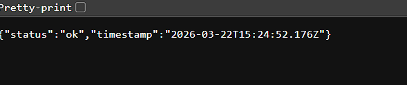
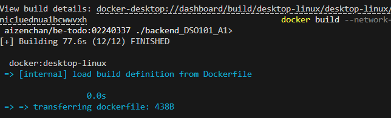

# Taskflow — Todo List App
### DSO101 Assignment 1 | CI/CD Pipeline
**Student Name:** `<Ugyen Kinley Phuntshok>`  
**Student Number:** `<02240337>`  

---

## Table of Contents
1. [Project Overview](#project-overview)
2. [Tech Stack](#tech-stack)
3. [Repository Structure](#repository-structure)
4. [Step 0 — Local Setup](#step-0--local-setup)
5. [Part A — Docker Hub Deployment](#part-a--docker-hub-deployment)
6. [Part B — Git-triggered Auto Deployment](#part-b--git-triggered-auto-deployment)
7. [Environment Variables Reference](#environment-variables-reference)
8. [API Reference](#api-reference)

---

## Project Overview

**Taskflow** is a full-stack to-do list web application built with:
- A **React** single-page frontend
- A **Node.js / Express** REST API backend
- A **PostgreSQL** relational database

The project demonstrates a full **CI/CD pipeline** using Docker Hub and Render.com — from local development to automated production deployments.

---

## Tech Stack

| Layer    | Technology            |
|----------|-----------------------|
| Frontend | React 18, nginx       |
| Backend  | Node.js 18, Express 4 |
| Database | PostgreSQL 15         |
| Registry | Docker Hub            |
| Hosting  | Render.com            |
| CI/CD    | GitHub Actions        |

---

## Repository Structure

```
studentname_studentnumber_DSO101_A1/
├── frontend/
│   ├── public/
│   │   └── index.html
│   ├── src/
│   │   ├── App.js          # Main React component (UI)
│   │   ├── App.css         # Styles
│   │   ├── api.js          # API service layer
│   │   └── index.js        # React entry point
│   ├── .dockerignore
│   ├── .env.example        # Template — never commit actual .env
│   ├── .env.production     # Build-time vars for production
│   ├── Dockerfile          # Multi-stage build (React → nginx)
│   └── package.json
├── backend/
│   ├── server.js           # Express API + DB logic
│   ├── .dockerignore
│   ├── .env.example        # Template — never commit actual .env
│   ├── Dockerfile
│   └── package.json
├── .github/
│   └── workflows/
│       └── docker-publish.yml   # GitHub Actions CI/CD
├── .gitignore
├── docker-compose.yml           # Local dev orchestration
├── render.yaml                  # Render Blueprint (Part B)
└── README.md
```

---

## Step 0 — Local Setup

### Prerequisites
- [Node.js 18+](https://nodejs.org/)
- [Docker Desktop](https://www.docker.com/products/docker-desktop/)
- [Git](https://git-scm.com/)
- [PostgreSQL](https://www.postgresql.org/) (or use Docker)

### 1. Clone the repository
```bash
git clone https://github.com/<your-username>/studentname_studentnumber_DSO101_A1.git
cd studentname_studentnumber_DSO101_A1
```

### 2. Configure environment variables

**Backend** — create `backend/.env` from the example:
```bash
cp backend/.env.example backend/.env
```
Edit `backend/.env`:
```env
PORT=5000
DB_HOST=localhost
DB_USER=postgres
DB_PASSWORD=yourpassword
DB_NAME=tododb
DB_PORT=5432
DB_SSL=false
FRONTEND_URL=http://localhost:3000
```

**Frontend** — create `frontend/.env` from the example:
```bash
cp frontend/.env.example frontend/.env
```
Edit `frontend/.env`:
```env
REACT_APP_API_URL=http://localhost:5000
```

> ⚠️ **IMPORTANT:** Both `.env` files are listed in `.gitignore` and will **never** be committed to Git.

### 3. Run with Docker Compose (recommended)
```bash
docker-compose up --build
```
This spins up all three services (db, backend, frontend) together.

| Service  | URL                     |
|----------|-------------------------|
| Frontend | http://localhost:3000   |
| Backend  | http://localhost:5000   |
| Database | localhost:5432          |

**Screenshot — App running locally:**


### 4. Run manually (without Docker)

**Start the database** (using Docker):
```bash
docker run -d \
  --name todo-db \
  -e POSTGRES_USER=postgres \
  -e POSTGRES_PASSWORD=postgres \
  -e POSTGRES_DB=tododb \
  -p 5432:5432 \
  postgres:15-alpine
```

**Start the backend:**
```bash
cd backend
npm install
node server.js
# Server running on port 5000 ✅
```

**Start the frontend:**
```bash
cd frontend
npm install
npm start
# App opens at http://localhost:3000 ✅
```

**Screenshot — Backend health check:**



---

## Part A — Docker Hub Deployment

### Step A1 — Build Docker images

Replace `yourdockerhub` with your Docker Hub username and `02190108` with **your student ID**.

**Build backend image:**
```bash
docker build -t yourdockerhub/be-todo:02190108 ./backend
```

**Build frontend image:**
```bash
docker build \
  --build-arg REACT_APP_API_URL=https://be-todo.onrender.com \
  -t yourdockerhub/fe-todo:02190108 \
  ./frontend
```

**Screenshot — Successful docker build output:**




### Step A2 — Push images to Docker Hub

**Login to Docker Hub:**
```bash
docker login
# Enter your Docker Hub username and password/token
```

**Push both images:**
```bash
docker push yourdockerhub/be-todo:02190108
docker push yourdockerhub/fe-todo:02190108
```

**Screenshot — Docker Hub showing pushed images:**

> 📸 *[Insert screenshot of hub.docker.com showing your be-todo and fe-todo repositories with the tag matching your student ID]*

### Step A3 — Deploy Backend on Render.com

1. Go to [render.com](https://render.com) → **New** → **Web Service**
2. Select **"Deploy an existing image from a registry"**
3. Enter the image URL: `yourdockerhub/be-todo:02190108`
4. Set the service name to `be-todo`
5. Select the **Free** plan
6. Under **Environment Variables**, add:

| Key           | Value                          |
|---------------|--------------------------------|
| `NODE_ENV`    | `production`                   |
| `PORT`        | `5000`                         |
| `DB_HOST`     | *(from Render PostgreSQL dashboard)* |
| `DB_USER`     | *(from Render PostgreSQL dashboard)* |
| `DB_PASSWORD` | *(from Render PostgreSQL dashboard)* |
| `DB_NAME`     | `tododb`                       |
| `DB_PORT`     | `5432`                         |
| `DB_SSL`      | `true`                         |

7. Click **Deploy**

**Screenshot — Render backend environment variables:**

> 📸 *[Insert screenshot of Render's environment variables panel for be-todo]*

**Screenshot — Render backend service live:**

> 📸 *[Insert screenshot of Render dashboard showing be-todo as "Live" with its URL]*

### Step A4 — Create PostgreSQL Database on Render

1. Go to Render → **New** → **PostgreSQL**
2. Name: `todo-db`, Plan: **Free**
3. Click **Create Database**
4. Copy the **Host**, **Username**, **Password**, and **Database** values into the backend service's environment variables (Step A3)

**Screenshot — Render PostgreSQL dashboard:**

> 📸 *[Insert screenshot of the Render PostgreSQL service showing connection details]*

### Step A5 — Deploy Frontend on Render.com

1. Go to Render → **New** → **Web Service**
2. Select **"Deploy an existing image from a registry"**
3. Enter: `yourdockerhub/fe-todo:02190108`
4. Name: `fe-todo`
5. Add environment variable:

| Key                  | Value                             |
|----------------------|-----------------------------------|
| `REACT_APP_API_URL`  | `https://be-todo.onrender.com`    |

6. Click **Deploy**

**Screenshot — Render frontend service live:**

> 📸 *[Insert screenshot of Render dashboard showing fe-todo as "Live"]*

**Screenshot — Full app working on Render URLs:**

> 📸 *[Insert screenshot of the Todo app working at https://fe-todo.onrender.com]*

---

